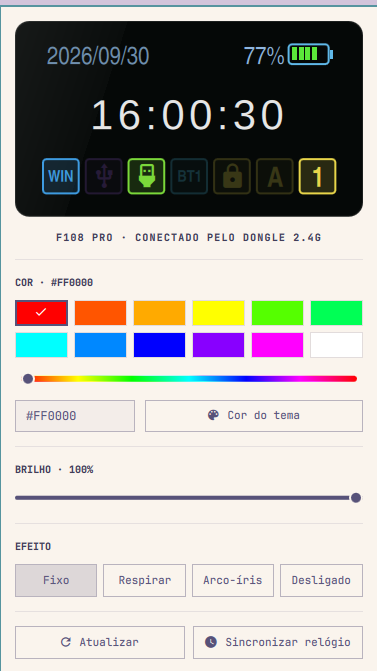

# AULA F108 Pro for Omarchy

An Omarchy shell plugin and Linux CLI (`almactl`) for the **AULA F108 Pro**
keyboard (also sold as **Alma F108 Pro**), over its 2.4 GHz USB dongle or its
USB cable.



- **LCD dashboard mirror**: date, battery, live clock, and connection and
  Caps/Num Lock tiles styled like the keyboard's own screen (lit when active).
- **Backlight**: color swatches, free hue, hex input, brightness, and effects
  (static, breathing, rainbow, off). Can follow the Omarchy theme accent.
- **Battery** in the bar tooltip, refreshed every minute and when the panel opens
  (2.4 GHz only; on the cable the keyboard is charging and reports no level).
- **Clock sync** for the keyboard's display, on demand and after every login.
- Right-click the bar icon to toggle the backlight.

## Requirements

- Omarchy with the Quickshell shell (plugin schema version 1)
- The keyboard on its **2.4 GHz dongle** (`05ac:024f`, "F108Pro Dongle") or its
  **USB cable** (`0c45:800a`, "SONiX AULA F108Pro"). When both are plugged in,
  the cable is used. Bluetooth is not supported: even the official AULA software
  cannot configure the keyboard over Bluetooth.
- Go (matching `go.mod`) to build `almactl`
- `jq`, `flock` and `timeout` (present on a stock Omarchy install)

## Install

```sh
omarchy plugin add https://github.com/kidush/omarchy-aula-f108pro.git
bash ~/.config/omarchy/plugins/kidush.aula-f108pro/install.sh
```

`omarchy plugin add` only clones and validates the plugin. `install.sh` builds
`almactl`, enables the widget on the right side of the bar and installs two
Omarchy hooks: `post-boot` (restore the backlight and sync the clock after
login) and `theme-set` (reapply the backlight when "follow theme" is on). It
backs up `~/.config/omarchy/shell.json` and any previous installation first.

From a local checkout, `bash install.sh` copies the plugin into
`~/.config/omarchy/plugins/kidush.aula-f108pro` and does the same steps. Pass
`--binary /path/to/almactl` to use a prebuilt binary.

### Device permissions

`almactl` talks to the keyboard through `/dev/hidraw*`. If `almactl info` says
permission denied, install the udev rule once (it grants the logged-in user
access to this keyboard's dongle and cable only):

```sh
sudo install -m 644 udev/70-aula-f108pro.rules /etc/udev/rules.d/
sudo udevadm control --reload && sudo udevadm trigger
```

Then unplug and replug the dongle or cable.

### Uninstall

```sh
omarchy plugin remove kidush.aula-f108pro
rm ~/.config/omarchy/hooks/post-boot.d/aula-f108pro.sh ~/.config/omarchy/hooks/theme-set.d/aula-f108pro.sh
```

## Usage

The backlight setting is saved in `~/.local/state/aula-f108pro/light.json`.
If the keyboard is asleep, the setting is kept and applied on the next login
or change. Keybinds can drive the plugin over IPC:

```sh
omarchy-shell kidush.aula-f108pro setColor FF0000
omarchy-shell kidush.aula-f108pro setMode breathing   # static|breathing|cycle|off
omarchy-shell kidush.aula-f108pro setBrightness 60
omarchy-shell kidush.aula-f108pro toggleLight
```

## CLI

```sh
go build -o bin/almactl ./cmd/almactl
./bin/almactl list        # the keyboard's HID interfaces (dongle and cable)
./bin/almactl info        # connection (usb or 2.4g) and, over 2.4g, battery
./bin/almactl listen      # print vendor-channel reports (read-only)
./bin/almactl sync-time   # set the keyboard clock to system time
./bin/almactl light -b 5 static FF0000   # modes: off, static, breath, spectrum, rolling
go test ./...
```

`internal/hidraw` handles Linux HID access; `internal/aula` implements the
2.4 GHz (`aula.go`) and wired (`wired.go`) protocols. Protocol research is in [docs/protocol.md](docs/protocol.md)
and [docs/protocol-hfd-web.md](docs/protocol-hfd-web.md). Remapping, macros
and screen uploads are documented research, not plugin controls yet.

## License

[MIT](LICENSE)
